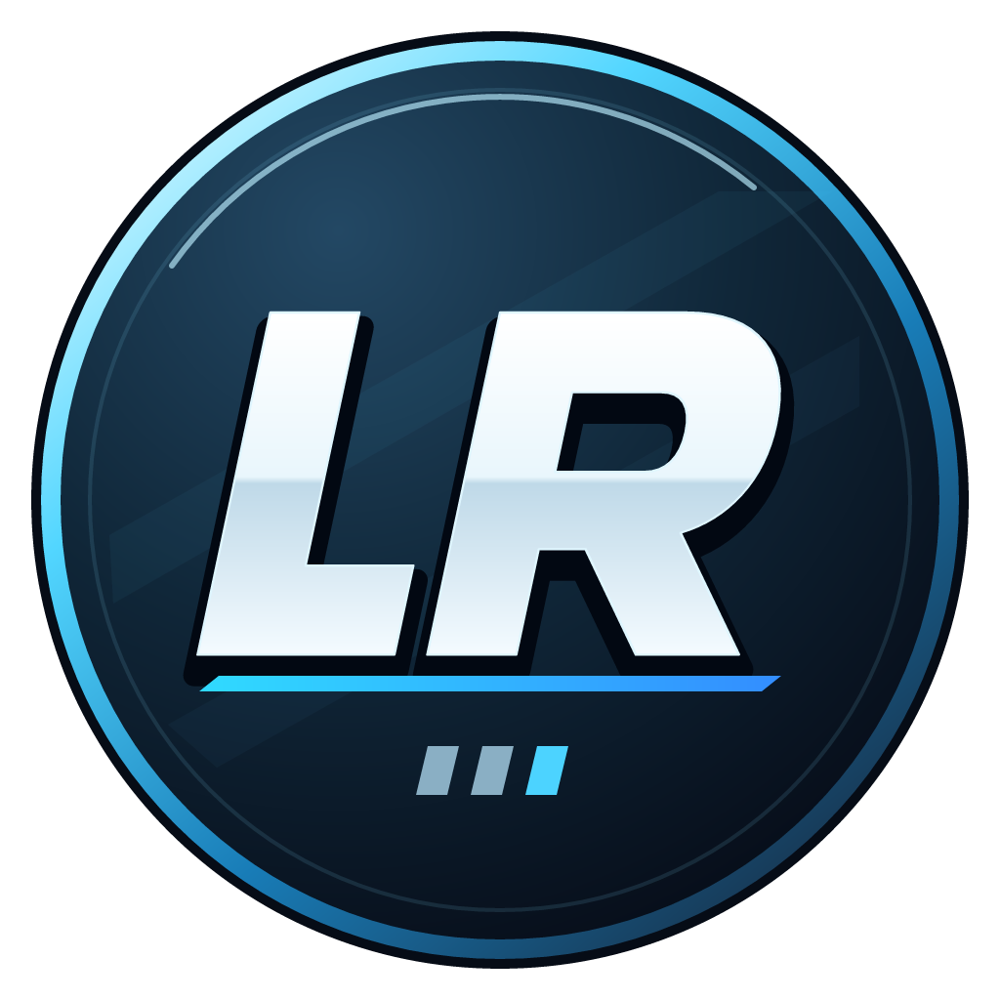

# LazerRave

<p align="center">
  
</p>

LazerRave is a BMS rhythm game combining a desktop client adapted from [osu!lazer](https://github.com/ppy/osu) with the [OpenLR2](https://github.com/GOMazk/OpenLR2) gameplay engine. It preserves classic LR2 gameplay and skin compatibility within the lazer interface.

The project is in **Beta** and targets **Windows 10/11 x64**.

[Website](https://lazerrave.com) · [Download](https://lazerrave.com/download) · [GitHub Releases](https://github.com/feecat/LazerRave/releases) · [Documentation](docs/index.md)

## Features

- Browse BMS folder hierarchies, search songs, select difficulties, and filter by key mode and level.
- Play through embedded OpenLR2, a separate game window, or the classic LR2 menu.
- Configure speed, timing, gauge, and arrangement; retain local scores and LR2 replays.
- Sign in for Internet Ranking, multiplayer rooms, chat, and temporary song sharing.
- Browse and download song packs into `BMS/Shared/`.

BMSON, BMS editing, cloud replay verification, and dedicated course certification remain planned. See the [roadmap](docs/roadmap.md).

## Download and run

Download the Windows ZIP from [Releases](https://github.com/feecat/LazerRave/releases), extract the entire folder to a writable location, and run `LazerRave.exe`. No separate .NET installation is required.

Put songs in `BMS/` or add library folders in Settings. The default game viewport is **1024×768**; the frontend starts windowed at **1920×1080**, fitted to the available screen area. Preserve `userdata/`, `BMS/`, and `LR2files/` when updating. Release packages contain clean defaults and exclude personal data and songs.

## Development

<details>
<summary>Build requirements and commands</summary>

Desktop builds require Visual Studio 2022 with MSVC v143 and a Windows SDK, .NET SDK 10.0.401, CMake 3.29+, Ninja, NASM, Git, Python 3.11+, and Windows PowerShell 5.1. Dependency builds also require PowerShell 7. Initial builds need network access; the script prepares local tools as needed.

Run from the repository root. **`build.cmd` is the single public build entry point.**

```powershell
.\build.cmd                  # Complete desktop application: out/app/
.\build.cmd -CompileOnly     # Compile without assembling a runtime
.\build.cmd -PackageZip      # Windows ZIP and SHA-256: out/releases/
.\build.cmd -EngineOnly      # Native engine only
.\build.cmd -Cloud           # Website and server: out/cloud/
```

Complete desktop packaging needs LR2 resources under `res/runtime/`, or an external directory supplied with `-RuntimeSource 'D:\LR2beta3'`. Private runtime resources and songs are excluded from Git. Builds do not launch the game or run tests; runtime updates close game processes in the destination directory.

Open `LazerRave.slnx` for C# development. Source modules are `src/LazerRave/` (client and bridge), `src/osu-lazer/` (adapted upstream), `src/OpenLR2/` (engine), and `src/Cloud/` (React website, ASP.NET Core API, SignalR, and PostgreSQL).

</details>

See [Build and run](docs/getting-started/build-and-run.md), [Repository layout](docs/development/project-layout.md), [Versioning and releases](docs/development/versioning-and-release.md), and [Cloud deployment](docs/operations/cloud-deployment.md).

## Credits

Thanks to [ppy and osu! contributors](https://github.com/ppy/osu), [GOMazk and OpenLR2 contributors](https://github.com/GOMazk/OpenLR2), and the BMS and LR2 communities. LazerRave is an independent project. See [LICENSE](LICENSE) and [third-party notices](res/licenses/).
